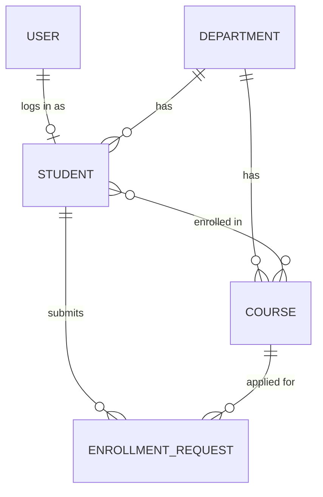

# Student Management System

A REST API for managing students, departments and courses. Students register and log in with **JWT**, apply for courses, and an **admin** approves or rejects each request. Built with Spring Boot, Spring Security, PostgreSQL and Redis.


---

## Table of contents

- [Features](#features)
- [Tech stack](#tech-stack)
- [Data model](#data-model)
- [Security: authentication and authorization](#security-authentication-and-authorization)
- [Enrollment workflow](#enrollment-workflow)
- [Caching with Redis](#caching-with-redis)
- [Getting started](#getting-started)
- [Configuration](#configuration)
- [API overview](#api-overview)
- [Testing the API](#testing-the-api)
- [Project structure](#project-structure)
- [Error format](#error-format)
- [Before deploying](#before-deploying)

---

## Features

**Core**
- Departments, courses and students with JPA relationships (one-to-many, many-to-many, embedded address)
- Pagination, sorting and search on the student list
- Bean validation on every request, with clear error messages
- Global exception handling with a consistent JSON error body

**Security**
- Registration and login for students (BCrypt password hashing)
- JWT access token (1 hour) sent as `Authorization: Bearer <token>`
- Two roles, `ADMIN` and `STUDENT`, enforced with URL rules and method-level `@PreAuthorize`
- Ownership checks: a student can only see and change their own requests
- Registration can only create `STUDENT` users; the admin account is created at startup

**Enrollment**
- A student applies for a course, an admin approves or rejects
- Course capacity and seat counting, with row locking so two requests cannot take the last seat
- Notification saved for every decision

**Files**
- Photo upload with multipart (JPEG or PNG, max 2 MB), checked by the file's real content, not its name

**Operations**
- Redis caching for departments, courses and students, with a 10 minute expiry
- The API keeps working if Redis is down (it falls back to the database)
- AOP aspect that logs the run time of every service method
- Spring Boot Actuator (health, info, metrics, loggers, caches) protected by its own login
- Swagger UI / OpenAPI documentation with a JWT **Authorize** button
- Request id in every log line, rolling log files
- Dev and prod profiles

---

## Tech stack

| Area | Technology |
|---|---|
| Language | Java 21 |
| Framework | Spring Boot 4.1 (Web MVC, Data JPA, Validation) |
| Security | Spring Security, JJWT 0.12 |
| Database | PostgreSQL |
| Cache | Redis (Spring Cache) |
| API docs | springdoc-openapi (Swagger UI) |
| Monitoring | Spring Boot Actuator |
| AOP | AspectJ (`spring-boot-starter-aspectj`) |
| Build | Maven (wrapper included) |
| Other | Lombok |

---

## Data model



- **User**: username, BCrypt password, role (`ADMIN` or `STUDENT`).
- **Student**: name, email, phone, date of birth, embedded address, photo, department, courses. Linked to a user if the student registered. Students created by an admin have no login.
- **Department**: name, code. Deleting a department deletes its courses (only when it has no students).
- **Course**: title, code, credits, capacity, enrolled count, department.
- **EnrollmentRequest**: student, course, status (`PENDING`, `APPROVED`, `REJECTED`).
- **Notification**: message saved when a request is decided.
- All entities record who created or changed them and when (JPA auditing).

---

## Security: authentication and authorization

```
Register  ->  creates a User (role STUDENT) and a linked Student
Login     ->  checks username and password, returns a JWT access token
Request   ->  Authorization: Bearer <token>
               filter validates signature and expiry, loads the user and role from the database,
               then the access rules below decide
```

- The token holds the username and the expiry only. The **role is read from the database on every request**, so a deleted user or a changed role takes effect immediately.
- **401 Unauthorized**: missing, invalid, tampered or expired token.
- **403 Forbidden**: valid user, but the role is not allowed.

### Who can do what

| Endpoint | No token | STUDENT | ADMIN |
|---|---|---|---|
| Register, login, Swagger | yes | yes | yes |
| `GET /api/profile`, photo | 401 | yes | yes |
| `GET` departments and courses | 401 | yes | yes |
| Create / update / delete departments and courses | 401 | 403 | yes |
| Everything under `/api/students/**` | 401 | 403 | yes |
| Apply for a course | 401 | only for yourself | for anybody |
| Read one request / requests of a student | 401 | only your own | yes |
| List all requests, approve, reject | 401 | 403 | yes |
| `GET /api/notifications/my` | 401 | yes | yes |
| `GET /api/notifications` (all) | 401 | 403 | yes |
| Actuator `health` and `info` | yes | yes | yes |
| Other actuator endpoints | HTTP Basic (separate actuator login) | | |

---

## Enrollment workflow

1. A **student** applies: `POST /api/enrollment-requests`. The request is `PENDING` and nothing is reserved. The student needs a department and the course must belong to it.
2. An **admin** decides:
   - **Approve**: one transaction with four saves (course seat count +1, student gets the course, request becomes `APPROVED`, notification saved). If the course is full the whole approval is refused with `409 COURSE_FULL` and nothing is saved.
   - **Reject**: one transaction with two saves (request becomes `REJECTED`, notification saved).
3. The student reads the result with `GET /api/notifications/my`.

---

## Caching with Redis

| Cache | What it holds |
|---|---|
| `departments` | department list and single departments |
| `courses` | course lists and single courses |
| `students`, `studentPages` | single students and student list pages |

- Reads use `@Cacheable`. Writes use `@CachePut` or `@CacheEvict`, and related caches are cleared too (for example a course change clears the cached students, because a student response contains course titles).
- Every entry expires after 10 minutes. Keys start with `sms:`.
- If Redis is unreachable, a warning is logged and the data is read from PostgreSQL.

---

## Getting started

### Prerequisites

- Java 21
- PostgreSQL
- Redis
- (Maven is not needed, the wrapper `mvnw` is included)

### 1. Clone

```bash
git clone <your-repository-url>
cd StudentManagementSystem
```

### 2. Create the database

```sql
CREATE DATABASE student_management_system;
```

Tables are created automatically on first start in the dev profile.

### 3. Start Redis

```bash
redis-cli ping      # should answer PONG
```

Install and start Redis first if it is not running (Windows: Memurai or WSL, macOS: `brew install redis && brew services start redis`, Linux: `sudo apt install redis-server`).

### 4. Set your database password

```bash
# macOS / Linux
export DB_PASSWORD=your_postgres_password

# Windows PowerShell
$env:DB_PASSWORD="your_postgres_password"
```

### 5. Run

```bash
./mvnw spring-boot:run        # Windows: mvnw.cmd spring-boot:run
```

Wait for `Started StudentManagementSystemApplication`. The app runs on **http://localhost:8080**.

### 6. Open Swagger

**http://localhost:8080/swagger-ui.html**

A default admin is created at startup (dev profile): username `admin`, password `admin123`. Change it with `ADMIN_PASSWORD`.

---

## Configuration

All settings can be overridden with environment variables.

| Variable | Purpose | Default (dev) |
|---|---|---|
| `DB_URL` | JDBC URL | `jdbc:postgresql://localhost:5432/student_management_system` |
| `DB_USERNAME` | database user | `postgres` |
| `DB_PASSWORD` | database password | set your own |
| `REDIS_HOST` | Redis host | `localhost` |
| `JWT_SECRET` | key that signs tokens (at least 32 characters) | a development value |
| `ADMIN_USERNAME` | seeded admin username | `admin` |
| `ADMIN_PASSWORD` | seeded admin password | `admin123` |
| `ACTUATOR_USER` | actuator username | `actuator` |
| `ACTUATOR_PASSWORD` | actuator password | `actuator123` |

**Profiles**

| Profile | Use |
|---|---|
| `dev` (default) | Local work. Schema is updated automatically, detailed logging, extra actuator endpoints. |
| `prod` | `DB_PASSWORD`, `JWT_SECRET`, `ADMIN_PASSWORD` and `ACTUATOR_PASSWORD` **must** be set (no defaults). Schema is only validated, so create it first. Start with `--spring.profiles.active=prod`. |

Other settings: tokens last 1 hour, uploads go to the `uploads/` folder, maximum upload size is 2 MB, logs are written to `logs/student-app.log`.

---

## API overview

Full details and request bodies are in Swagger UI.

### Authentication (public)

| Method | Path | Description |
|---|---|---|
| POST | `/api/auth/register` | Register a student (multipart form: username, firstName, lastName, email, phone, dateOfBirth, password, optional photo) |
| POST | `/api/auth/login` | Returns the JWT access token |

### Profile (any logged-in user)

| Method | Path | Description |
|---|---|---|
| GET | `/api/profile` | Who am I (username, role, student data) |
| POST | `/api/profile/photo` | Upload or replace my photo |
| GET | `/api/profile/photo` | Download my photo |

### Departments and courses (read: any user, change: ADMIN)

| Method | Path | Description |
|---|---|---|
| POST, GET | `/api/departments` | Create, list |
| GET, PUT, PATCH, DELETE | `/api/departments/{id}` | One department |
| POST, GET | `/api/courses` | Create, list (`?departmentId=` filter) |
| GET, PUT, PATCH, DELETE | `/api/courses/{id}` | One course |

### Students (ADMIN)

| Method | Path | Description |
|---|---|---|
| POST | `/api/students/create` | Create one student (no login) |
| POST | `/api/students/createall` | Create many (all or nothing) |
| GET | `/api/students/getall` | Paged list. Params: `page`, `size` (1 to 100), `sortBy` (`id`, `firstName`, `lastName`, `email`, `dateOfBirth`), `direction` (`asc`, `desc`), `keyword`, `departmentId`, `courseId` |
| GET | `/api/students/get/{id}` | One student |
| PUT | `/api/students/update/{id}` | Replace details |
| PATCH | `/api/students/patch/{id}` | Change some fields |
| DELETE | `/api/students/delete/{id}` | Delete (also removes the login and frees course seats) |
| POST | `/api/students/{id}/department/{departmentId}` | Assign a department |
| POST, DELETE | `/api/students/{id}/courses/{courseId}` | Enrol / drop directly |
| POST | `/api/students/{id}/image` | Upload a student's image |

### Enrollment requests and notifications

| Method | Path | Who |
|---|---|---|
| POST | `/api/enrollment-requests` | ADMIN, or the student for themselves |
| GET | `/api/enrollment-requests` (`?status=`) | ADMIN |
| GET | `/api/enrollment-requests/{id}` | ADMIN, or the owner |
| GET | `/api/enrollment-requests/student/{studentId}` | ADMIN, or that student |
| POST | `/api/enrollment-requests/{id}/approve` | ADMIN |
| POST | `/api/enrollment-requests/{id}/reject` | ADMIN |
| GET | `/api/notifications/my` | any logged-in user |
| GET | `/api/notifications` (`?email=`) | ADMIN |

### Monitoring

`/actuator/health` and `/actuator/info` are public. `metrics`, `loggers`, `caches` and `env` need HTTP Basic with the actuator login.

---

## Testing the API

### Swagger UI

1. Open `http://localhost:8080/swagger-ui.html`.
2. Register a student (`POST /api/auth/register`), then log in (`POST /api/auth/login`) and copy the `token`.
3. Click **Authorize**, paste **only the token**, and click Authorize.
4. Try the endpoints:
   - `GET /api/courses` works (200).
   - `POST /api/courses` is refused (**403**) for a student.
5. Click Authorize, Logout, log in as `admin` and authorize with the admin token. Now the admin endpoints work.
6. Without a token every protected endpoint returns **401**.

### Postman

Import `postman/StudentManagementSystem-v5-jwt-roles.postman_collection.json`.

1. Run **1.1 Register**, **1.2 Login as ADMIN**, **1.3 Login as STUDENT**. The scripts store both tokens and every request uses the right one automatically.
2. Run the folders in order. They cover authentication checks (401), role and ownership checks (403), CRUD, pagination and search, the enrollment workflow, error cases and cleanup.
3. Each request has tests. Requests in the error folders pass when the server refuses them with the expected status.

---

## Project structure

```
src/main/java/org/example/studentmanagementsystem
├── aspect/        execution-time logging (AOP)
├── audit/         who created or changed a record
├── config/        security, OpenAPI, cache, web, admin seeder, request logging
├── controller/    REST controllers (auth, profile, students, departments, courses,
│                  enrollment requests, notifications)
├── dto/           request and response objects
├── entity/        JPA entities (User, Student, Department, Course, EnrollmentRequest, Notification)
├── exception/     custom exceptions and the global handler
├── repository/    Spring Data repositories and search specifications
├── security/      JWT service and filter, user details, access checks
└── service/       business logic (interfaces and impl)
```

---

## Error format

Every error returns JSON.

```json
{
  "timestamp": "2026-01-15T10:30:00",
  "status": 409,
  "error": "Conflict",
  "code": "COURSE_FULL",
  "message": "Course is full: DS101"
}
```

Validation errors return status `400` with an `errors` object that lists each invalid field. A forbidden request returns `403`. A missing or invalid token returns `401` with no body.

---

## Before deploying

- Use the `prod` profile and set `JWT_SECRET`, `DB_PASSWORD`, `ADMIN_PASSWORD` and `ACTUATOR_PASSWORD` yourself. Never use the development defaults outside your own machine.
- Do not commit passwords, `uploads/` or `logs/`.
- Put the app behind HTTPS so tokens are not sent in clear text.

---

## Author

anudnya, [https://github.com/anudnya7/StudentManagementSystem]
